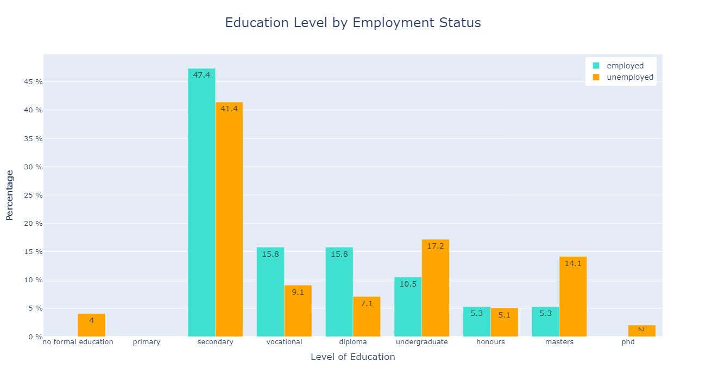

# Employment challenges for persons with disabilities in South Africa using logistic regression 

## Introduction
South Africa has the highest unemployment globally and we do not know what this means for persons with disabilities. Many studies have tried to identify what the unemployment rates are for persons with disabilities but are unable to get clear data. While the government has put in place extensive measures, laws, and incentives to boost employment for persons with disabilities, many continue to face significant challenges. This project aims to find out what factors influence employment and examines their experiences when seeking work. Its goal is to capture what is currently happening, identify key influencers on employment and suggest what can be done. This study was conducted for publication in a book with Lived Places Publishing. 

## Survey Design & Data Collection
This project presents the findings of a comprehensive survey conducted between June 2023 and March 2024, exploring the employment experiences of persons with disabilities in South Africa. The survey was designed to gather detailed insights by asking questions about individuals’ demographic and socio-economic background, along with qualitative questions on their experiences in seeking employment. 
Multiple channels were used for data collection including digital platforms (VoiceForm and Google Forms), in-person interviews, telephone calls, and WhatsApp. The survey was offered in English, isiXhosa, and Afrikaans. After a thorough data cleaning process, the final analysis was based on a sample of 118 responses.

## Data Cleaning
At the end of the survey collection period, 129 respondents participated in the survey. After reading through responses, 11 respondents either misunderstood the survey or did not understand a great deal of the questions. They were thus removed leaving 118 respondents, 99 unemployed and 19 employed persons with disabilities.
During the initial data cleaning process, I manually reviewed all ‘other’ selections and reclassified them into the appropriate existing options. This happened either because a respondent misunderstood the category or misinterpretation of the speech to text conversion.
For questions where respondents could select multiple options (e.g., multiple disabilities), I used pandas’ explode function to split the list-like entries into separate rows, ensuring it’s in a different data frame to avoid errors.
The duration of unemployment was in increments of 6 months, this was converted into increments of 1 year.
Respondents were grouped into age groups according to South African national age groups, '18-24', '25-34', '35-44', '45-54', '55+'.

## Descriptive analyses
After cleaning the data, I generated frequency distributions and visualizations to examine how demographic and socio-economic factors relate to employment status. This is a snapshot that capturer the most significant trends in the dataset which laid the groundwork for deeper analysis. To see the full report, open the file titled ‘Descriptive analyses’

It can be seen here that the vast majority of persons with disabilities in this dataset is unemployed (83.9%) with only 16.1% employed

Most strikingly, here we see that 35.6% of the total respondents are unemployed and have never held any form of employment before. We then see that only 11% of respondents are currently employed and have previous work experience.

It is often assumed that higher levels of education or the lack thereof has a direct impact on employment outcomes. Here we see that a significant amount (54.3%) of respondents have post-secondary education. 

These results show that for traditional higher education such as undergraduate and above, most respondents with these qualifications are unemployed. In the cases where we se higher employed than unemployment rates were with secondary, vocational and diploma qualifications.

A very significant trend was the gender disparity. Among male respondents, 77.3% are unemployed compared to 22.7% who are employed. For female respondents, 87.8% are unemployed and only 12.2% are employed. This indicates that women with disabilities have an unemployment rate of 10.5 percentage points higher than that of their male counterparts. 

Another puzzling result was the income distribution by employment status. These results are by household income and we see in households where the respondent is employed, 36.8% of this group fall into the lowest income bracket.

These results are more pronounced when we look at gender. Of households with employed women, 55% are in this lowest income group compared to 20% of employed men in this group.

We see here what we already expected that the South African youth have significantly high unemployment rates. However, we see consistently high unemployment rates  overall with it improving as respondents get older. So hence we ask, is the longer someone is seeking employment,the more likely they are to be employed?

Here we look at the duration of unemployment. Most significantly, the largest proportion of respondents in a group falls into the longest duration category of 7-8 years of unemployment. The data shows a bimodal distribution with peaks at both ends of the timeline - 19.5% of respondents have been unemployed for 0-1 years, and 22.9% have been unemployed for 7-8 years.

## Data Preprocessing

In preparation for logistic regression, the data was pre-processed to handle the categorical variables appropriately:

- **Ordinal Encoding:**  
  Level of education, duration unemployed, and household income were ordinally encoded.

- **Label Encoding:**  
  Binary variables such as gender, location, experience, and assistive tech were label encoded.

- **One-hot and Multi-hot Encoding:**  
  Type of disability and race were encoded using one-hot and multi-hot encoding, respectively. This approach was used because several respondents indicated more than one disability.

- **Target Variable Encoding:**  
  Employment status was label encoded with `1` representing unemployment and `0` representing employment.

## Logistic Regression Analysis
After preprocessing the data, I performed logistic regression using statsmodel. The purpose of the logistic regression is to determine how various factors influence employment outcomes. 
Since the race variable had 2 categories with perfect separation (showing 100% unemployment), I applied L1 regularization to stabilise the model. 
Additionally, I used StandardScaler from scikit-learn to normalize the age variable before fitting the model.
After fitting the model, I calculated the odds ratios by exponentiating the regression coefficients. These odds ratios provide a clear interpretation: for instance, an odds ratio above 1 indicates that a one-unit increase in the predictor is associated with increased odds of unemployment (1 represents unemployment), while an odds ratio below 1 indicates decreased odds. 
This may seem strange to have 1 as unemployment, but the goal of this study was to see what influences and why persons with disabilities are unemployed.

| Variable                | Coefficient | Standard Error | p-value | 0.025   | 0.975   | Odds Ratio         |
|-------------------------|-------------|----------------|---------|---------|---------|--------------------|
| Intercept (const)       | 0.8498      | 1.922          | 0.658   | -2.918  | 4.617   | 2.338              |
| Age                     | -0.8050     | 0.360          | 0.025   | -1.510  | -0.100  | 0.446              |
| Education               | -0.0855     | 0.204          | 0.674   | -0.484  | 0.313   | 0.918              |
| Household Income        | -0.7062     | 0.235          | 0.003   | -1.167  | -0.245  | 0.493              |
| Duration Unemployed     | 0.3102      | 0.157          | 0.049   | 0.002   | 0.619   | 1.364              |
| Mental Health Condition | 0.4313      | 1.783          | 0.809   | -3.064  | 3.927   | 1.539              |
| Hearing Impairment      | 0.1947      | 1.400          | 0.889   | -2.550  | 2.939   | 1.215              |
| Visual Impairment       | 0.1996      | 1.234          | 0.872   | -2.220  | 2.619   | 1.221              |
| Physical Disability     | 1.2460      | 1.216          | 0.306   | -1.138  | 3.630   | 3.476              |
| Gender                  | 1.1697      | 0.671          | 0.081   | -0.145  | 2.484   | 3.221              |
| Race: African           | -1.8173     | 1.106          | 0.100   | -3.985  | 0.350   | 0.162              |
| Race: Coloured          | 18.9239     | 11800          | 0.999   | -23200  | 23200   | 165409588.740      |
| Race: Indian            | 26.5496     | 146000         | 1.000   | -286000 | 286000  | 339099298333.170   |
| Location                | -0.6125     | 0.686          | 0.372   | -1.957  | 0.732   | 0.542              |
| Experience              | 1.3772      | 0.828          | 0.096   | -0.246  | 3.000   | 3.964              |
| Assistive Technology    | 1.6221      | 0.866          | 0.061   | -0.075  | 3.319   | 5.064              |

## Key Findings

- **Age:**  
  A one-unit increase in age is associated with a **55% decrease** in the odds of being unemployed (OR = 0.446, p = 0.025). This suggests that older individuals tend to have lower odds of unemployment.

- **Household Income:**  
  Each one-unit increase in household income is associated with approximately a **50.7% decrease** in the odds of unemployment (OR = 0.493, p = 0.003).

- **Duration Unemployed:**  
  Each additional unit increase in the duration of unemployment raises the odds of being unemployed by approximately **36%** (OR = 1.364, p = 0.049)

## Unexpected Findings

- **Gender:**  
  The model shows an odds ratio of **3.221** for the gender variable. This suggests that female respondents have about a **222% increase** in the odds of being unemployed compared to male respondents, though the p-value of 0.081 is not statistically significant.

- **Assistive Technology:**  
  The odds ratio for the use of assistive technology is **5.064**. This translates to approximately **406% increase** in the odds of unemployment, with a p-value of 0.061. While this suggests a strong association, the result is only marginally significant.
